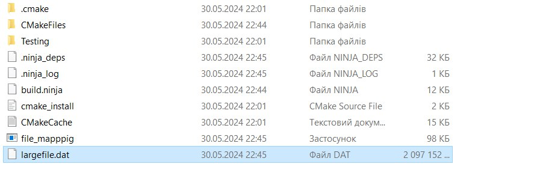
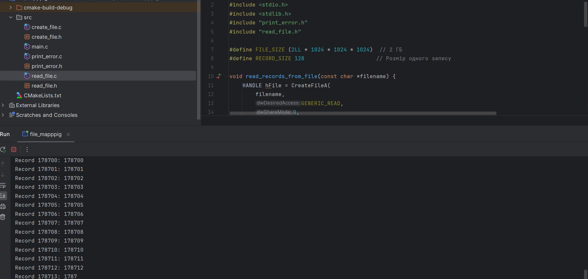
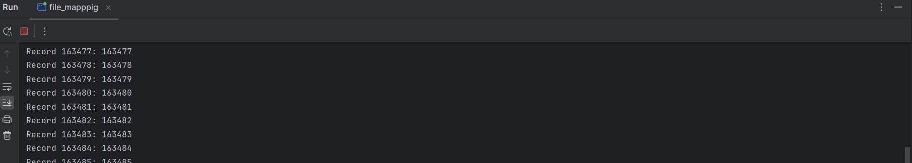

# File Mapping Project

This project demonstrates how to create and manipulate a large file (2 GB) using memory mapping in C on Windows. The project is divided into several parts:

1. **Creating and initializing a large file with fixed-length records.**
2. **Reading records from the large file using memory mapping.**

## Project Structure

file_mapping_project/  
|-- CMakeLists.txt  
|-- screenshots/  
| |-- created_file.jpg  
| |-- reading_file_1.jpg  
| |-- reading_file_2.jpg  
|-- src/  
| |-- print_error.c  
| |-- print_error.h  
| |-- create_file.c  
| |-- create_file.h  
| |-- read_file.c  
| |-- read_file.h  
| |-- main.c  
|-- README.md  

### Files Description

- **src/print_error.c** and **src/print_error.h**: Contains a utility function `print_last_error` for printing detailed error messages.
- **src/create_file.c** and **src/create_file.h**: Functions for creating and initializing a large file with fixed-length records.
- **src/read_file.c** and **src/read_file.h**: Functions for reading records from the file using memory mapping.
- **src/main.c**: Main function that orchestrates the creation and reading of the file.
- **CMakeLists.txt**: CMake configuration file for building the project.

## Created File

## Reading file 1 screenshot

## Reading file 2 screenshot

